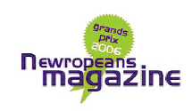
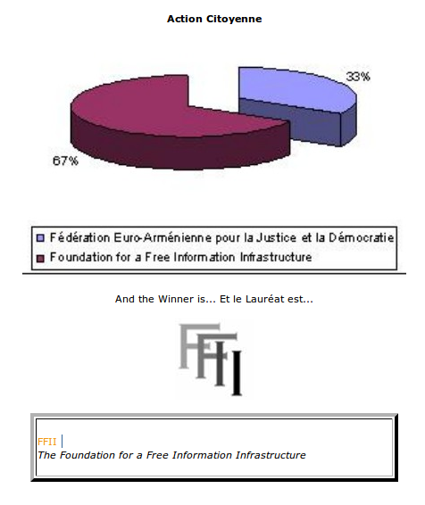

The FFII won the [Grand Prix 2006](http://www.newropeans-magazine.org/index.php?option=com_content&task=view&id=5104&Itemid=256) awarded by the [Newropeans Magazine](http://www.newropeans-magazine.org) in the category "Citizenship - Citizens Action". The award highlights through three different aspects the essential link between European construction and democracy:

1\. by rewarding the actors of this European democratisation 2. by having the winners elected by representatives of the European civil society 3. by considering democratization a very concrete process involving European mobility, accessibility and conviviality

