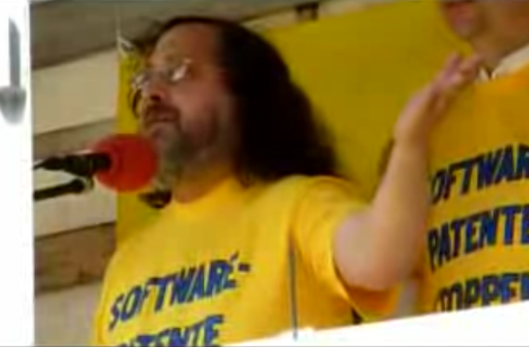
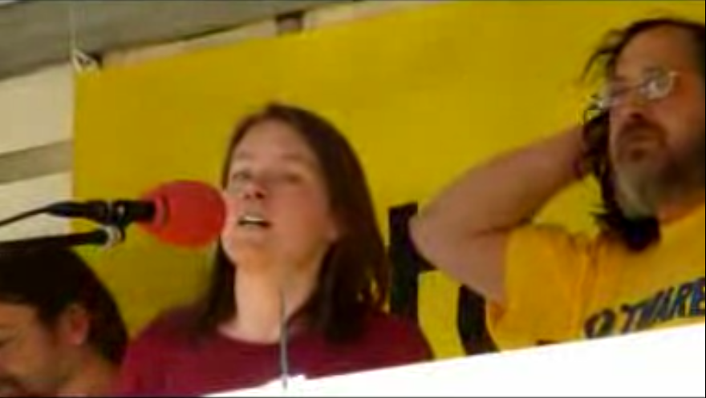

FFII members participation on critical activities about the European Patent System in Munich on 15th April 2009. Hartmut Pilch invited [Richard Stallman](http://en.wikipedia.org/wiki/Richard_Stallman) to give a speech and educate the public about Software Patents.

<iframe src="https://www.youtube.com/embed/8uv1JzwNuW0" width="640" height="480" frameborder="0" allowfullscreen="allowfullscreen"></iframe>

Original videos here: [video-1](http://boycottnovell.com/videos/rms-eu-part-1.ogg), [video-2](http://boycottnovell.com/videos/rms-eu-part-2.ogg)

 

