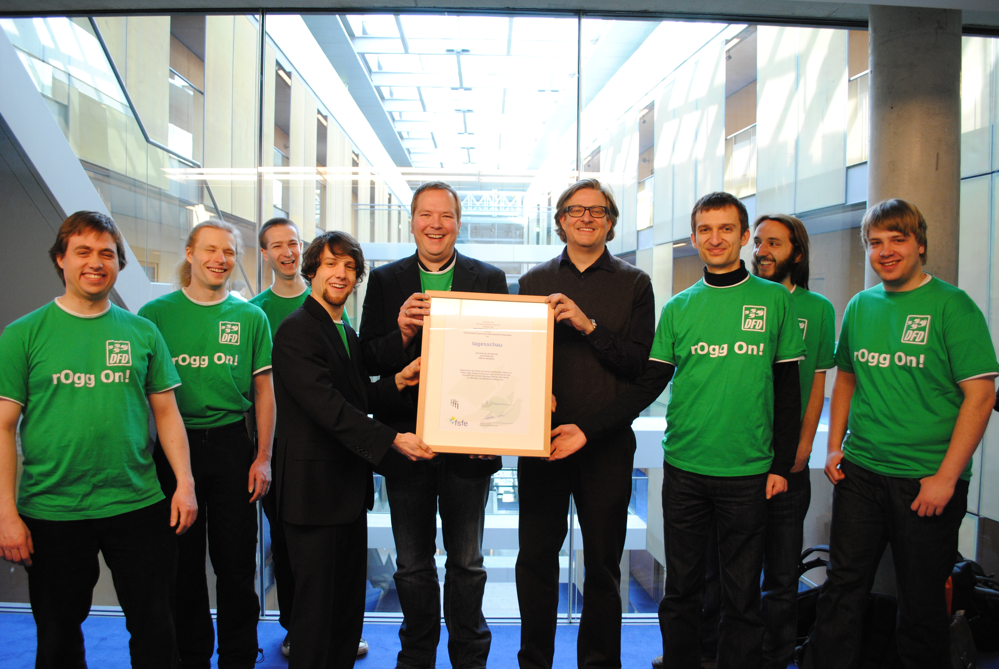
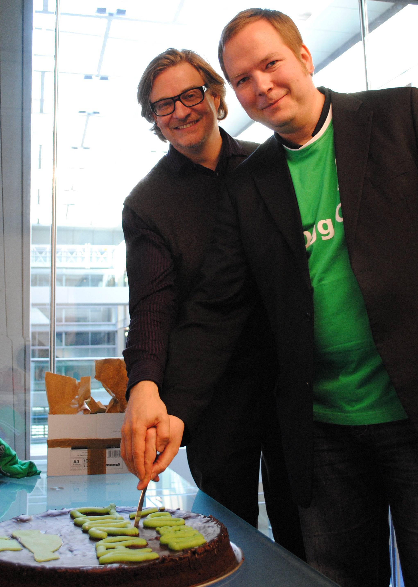

On the 30th of March, 2011, the FFII and FSFE awarded tagesschau.de the DFD Award for its use of Open Standards in broadcasting content. Berlin and Hamburg Fellows joined the event to celebrate the important role of tagesschau.de in spreading Document Freedom, eat a piece of pie, and have a chat about Freedom and Open Source Software and Open Document formats.

Press review for the Berlin event:

- 2011-03-30 DE [Heise: Tagesschau.de wegen Ogg-Theora-Unterstützung ausgezeichnet](http://www.heise.de/newsticker/meldung/Tagesschau-de-wegen-Ogg-Theora-Unterstuetzung-ausgezeichnet-1217681.html)
- 2011-03-30 EN [The H: Tagesschau.de receives Document Freedom Day award from FSFE and FFII](http://www.h-online.com/open/news/item/Tagesschau-de-receives-Document-Freedom-Day-award-from-FSFE-and-FFII-1217872.html)
- 2011-03-30 DE [Golem: FFII und FSFE ehren Tagesschau.de für Inhalte im Ogg-Theora-Format](http://www.golem.de/1103/82442.html)
- 2011-03-30 DE [Readers Edition: Die Netzversion der Tagesschau ist "offen"](http://www.readers-edition.de/2011/03/30/die-netzversion-der-tagesschau-ist-offen/)
- 2011-03-30 DE [Linux Community: Eine Torte für offene Formate FSFE und FFII zeichnen ARD für freie Formate bei Online-Tagesschau aus](http://www.linux-community.de/Internal/Nachrichten/FSFE-und-FFII-zeichnen-ARD-fuer-freie-Formate-bei-Online-Tagesschau-aus)
- 2011-03-30 DE [Linux Magazin: FFII und FSFE zeichnen ARD für Einsatz von Ogg aus](http://www.linux-magazin.de/NEWS/FSFE-zeichnet-ARD-fuer-Einsatz-von-Ogg-aus)
- 2011-03-30 DE [Netzpolitik.org: Offene Standards: Singapur, München, Tagesschau und der Rest der Welt](http://www.netzpolitik.org/2011/offene-standards-singapur-munchen-tagesschau-und-der-rest-der-welt/)
- 2011-03-30 DE [Prolinux: Auszeichnungen für den Einsatz offener Standards für Tagesschau.de und München](http://www.pro-linux.de/news/1/16879/auszeichnungen-fuer-den-einsatz-offener-standards-fuer-tagesschaude-und-muenchen.html)

