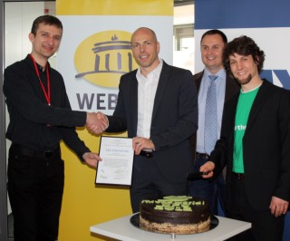

**Karlsruhe, 28 March 2012 -- 1&1, GMX and WEB.DE receive the German Document Freedom Award for the use of Open Standards. The prize is awarded by the Free Software Foundation Europe (FSFE) and the Foundation for a Free Information Infrastructure e.V. (FFII). 1&1 is awarded for automatically adding XMPP for all customers of their mail services. The Document Freedom Award is awarded annually on the occasion of Document Freedom Day - the international day for Open Standards. Last years winners include tagesschau.de, Deutschland Radio, and the German Foreign Office.**

Stephan Uhlmann (FFII), Jan Oetjen (1&1, Vorstand Portale), Tino Anic (1&1), Matthias Kirschner (FSFE)

In Karlsruhe FSFE and FFII handed over a certificate and the Document Freedom Award-cake to Jan Oetjen, CEO 1&1 Internet Portals, and Tino Anic with his team, who are responsible for this functionality. The Extensible Messaging and Presence Protocol (XMPP, previously called Jabber) is an Open Standard communication protocol used for chatting. A variety of chat programs support this protocol, and it is also used in VoIP applications. Every e-mail users of 1&1, GMX and WEB.DE get such an XMPP account by default, which has the same name as the e-mail address.

_"Unlike closed services such as Facebook and Skype, 1&1 has provided open connectivity with the rest of the Jabber/XMPP network for many years. They are to be commended for supporting truly free communication using Internet standards."_ says Peter Saint-Andre, Executive Director of the XMPP Foundation.

Like 1&1, everyone can set up an XMPP server and enable it to connect with other XMPP standard compliant servers around the world. People having an account from 1&1 are able to chat with other contacts, within or outside the 1&1 network, using any XMPP supporting client they want. They can chat with customers from other XMPP supporting companies like Google (with Google Talk), with people who set up their own Free Software XMPP server, and with all of FSFE's supporters, which also automatically get an XMPP account. When using Skype, ICQ, Facebook, Yahoo! Messenger or Microsoft Network (MSN), all the people who want to chat with each other have to use the same provider.

_"Facebook and Microsoft Network (MSN) also use XMPP for their chat functionality. But they disabled the XMPP server feature to connect with other XMPP servers. This way Facebook and MSN are restricting their users to their own service: You are only allowed to talk with people who also have an account at their service and surrendered their data. By using XMPP servers which connect with other XMPP servers, you give your friends the freedom to decide which software and which provider they want to use and trust!"_, says Matthias Kirschner, FSFE's German Coordinator.

_"We are very honoured to receive this award. It confirms our decision to use the open standard XMPP for our online chat within WEB.DE, GMX and 1&1 mailboxes. It allows our users to chat without technical barriers across the web."_, says Jan Oetjen, CEO 1&1 Internet Portals.

Stephan Uhlmann, FFII board member, adds: _"We're inspired by companies like 1&1 Internet AG who not only base their business on Internet open standards, like email and the web, but also keep these services interoperable and do not rely on lock-in effects to convince their customers."_

### Links

- Press pictures of the award ceremony are available on
    
    [https://wiki.fsfe.org/DFD-2012-Karlsruhe](https://wiki.fsfe.org/DFD-2012-Karlsruhe)
    
- XMPP chat programs: [http://xmpp.org/xmpp-software/clients/](http://xmpp.org/xmpp-software/clients/)
    
- FFII's Open Standard definition and working group
    
    [http://action.ffii.org/openstandards](http://action.ffii.org/openstandards)
    
- Permanent link to this press release
    
    [http://press.ffii.org/Press%20releases/1&1%20Internet%20AG%20receives%20German%20Document%20Freedom%20Award](http://press.ffii.org/Press%20releases/1&1%20Internet%20AG%20receives%20German%20Document%20Freedom%20Award)
    

### Press contacts

Stephan Uhlmann Foundation for a Free Information Infrastructure Malmöer Str. 6 10439 Berlin Tel: +49-30-41722597 Mobile: +49-170-4225008

## About the Document Freedom Day

Document Freedom Day (DFD) campaigns to celebrate information accessibility and introduce non-technical audiences to Open Standards. Open Standards are a basic condition for freedom and choice in software; ensuring the freedom to access data, and the freedom to build Free Software to read and write information. Started in 2008, the campaign has resulted in hundreds of events worldwide, and this year will take place on March 28th. This year 28 partners are supporting DFD.

[http://documentfreedom.org/](http://documentfreedom.org/)

## About the Free Software Foundation Europe

The Free Software Foundation Europe (FSFE) is a non-profit non-governmental organisation active in many European countries and involved in many global activities. Access to software determines participation in a digital society. To secure equal participation in the information age, as well as freedom of competition, the Free Software Foundation Europe (FSFE) pursues and is dedicated to the furthering of Free Software, defined by the freedoms to use, study, modify and copy. Founded in 2001, creating awareness for these issues, securing Free Software politically and legally, and giving people Freedom by supporting development of Free Software are central issues of the FSFE.

[http://www.fsfe.org/](http://www.fsfe.org/)

## About FFII

The FFII is a not-for-profit association registered in twenty European countries, dedicated to the development of information goods for the public benefit, based on copyright, free competition, open standards. More than 1000 members, 3,500 companies and 100,000 supporters have entrusted the FFII to act as their voice in public policy questions concerning exclusion rights ("intellectual property") in data processing.

[http://www.ffii.org/](http://www.ffii.org/)
