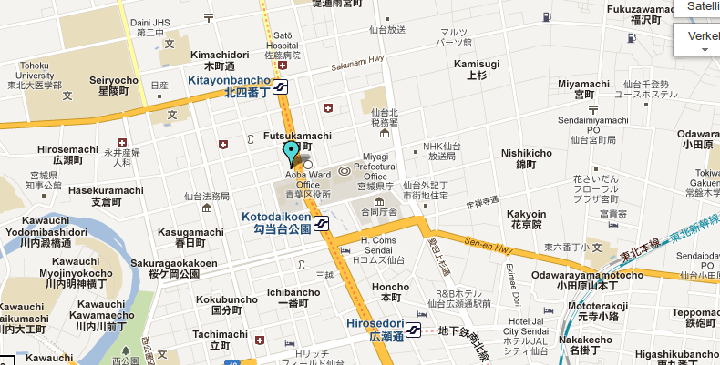

Tomorrow, Saturday 9 June, there will be more than 120 demonstrations against the Anti-Counterfeiting Trade Agreement (ACTA). Most of them take place in Europe, but there will also be demonstrations in Sendai (Japan), Montreal (QC, Canada), Kansas and New York (US). See this [map](https://maps.google.com/maps/ms?msid=214917285437566492834.0004bf01e005a41a2f7fa&msa=0&ll=51.096623,12.260742&spn=24.452056,67.631836), [Stopp-ACTA](http://wiki.stoppacta-protest.info/Main_Page) and [Access Now](https://www.accessnow.org/policy-activism/press-blog/acta-protests-june-9-international-day-of-action).

ACTA is not dead, see EDRi: [ACTA – the final weeks before the EP's vote](http://www.edri.org/edrigram/number10.11/acta-final-weeks-eu-vote)

Update: link to map updated
