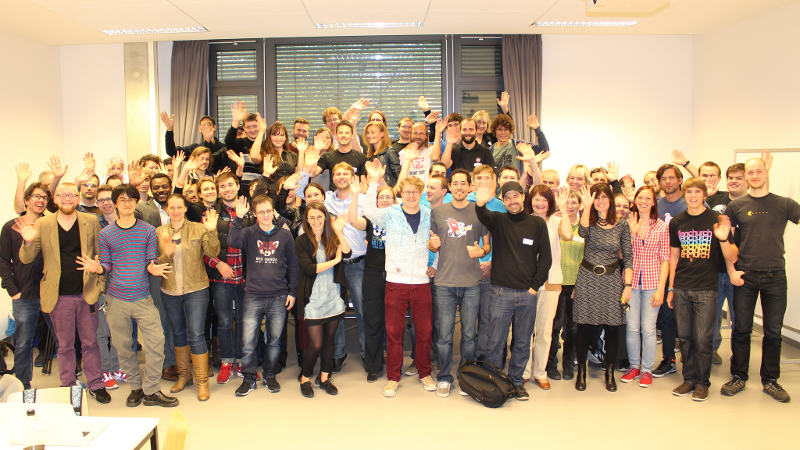
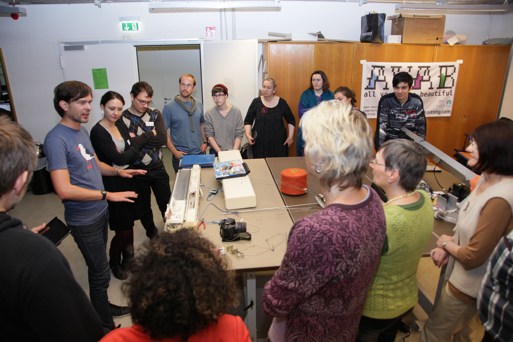
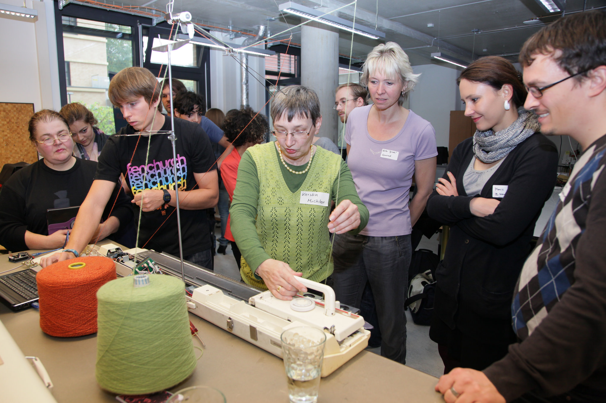
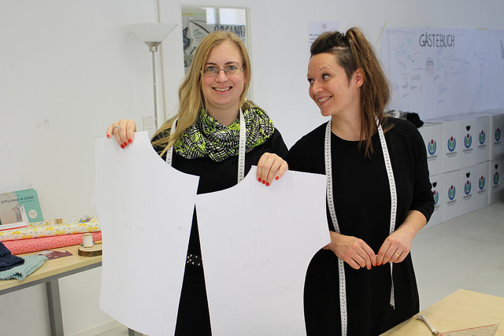
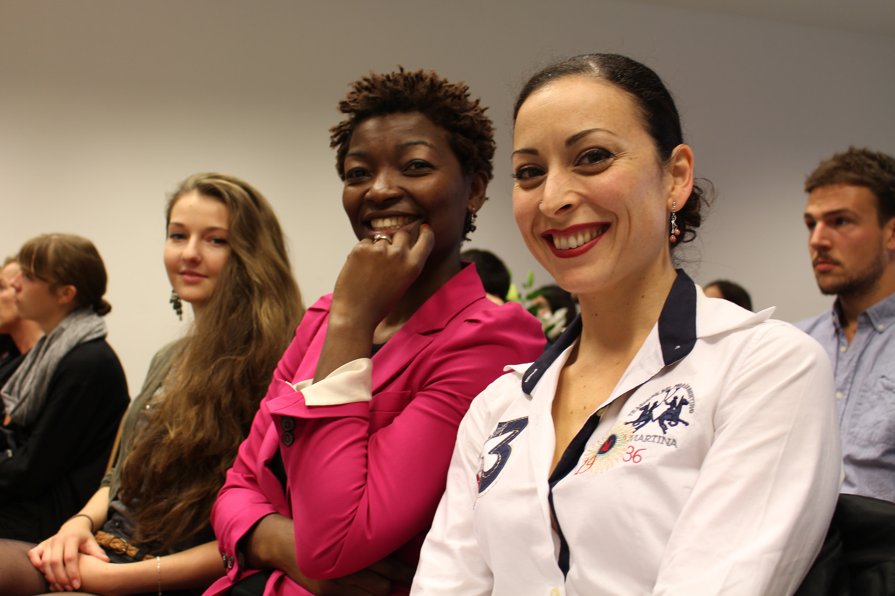

The first [Meshcon FashionTec Week](http://2014.meshcon.net) took place from October 10-15, 2014 in Berlin with the support of the FFII e.V. The event attracted 23 speakers from around the world and gathered hundreds of attendees from the technology and fashion community.

The FFII invited software engineers, creative minds and fashion hackers to the MeshCon 14’ in Berlin. The technology week is organised in cooperation with the TU Berlin, BBW, Wikimedia and the Mozilla Community. The Meshcon is about local production, design and distribution of textiles in a way that reaps the full benefit of the digital dividend.

<iframe src="https://www.youtube.com/embed/D-oLxNv_hTM" width="640" height="360" frameborder="0" allowfullscreen="allowfullscreen"></iframe>

The goal of the event was to explore the benefits of participatory production in the textile industry. Software developers, hardware makers, fashion designers, pattern creators, knitters, and textile manipulators exchanged ideas for fair personalized fashion and future technologies of production. Presentation included topics about digital makeovers of knitting machines, open-source-pattern making software, their latest web start-ups, the digital design studio and wearables.

At the event participants discussed concepts and Free and Open Source technologies for fair and environment friendly production of garments and textiles at home and in the industry. MeshCon Berlin brings together industry representatives, fashion designers, pattern creators, knitters, textile manipulators, FOSS developers and DIY hardware makers. The event offers a place to exchange new ideas in personalized fashion and technologies in the garment production.

 

Participants from 14 countries joined the five day event at locations around Berlin city. The first day will started with a conference at the Technische Universität Berlin. In the following days participants learned how to create your own fashion and wearables at workshops at the Wikimedia Deutschland e.V. office and Nadelwald co-working space.

Links: [http://2014.meshcon.net](http://2014.meshcon.net) | [http://fashiontec.org](http://fashiontec.org)
