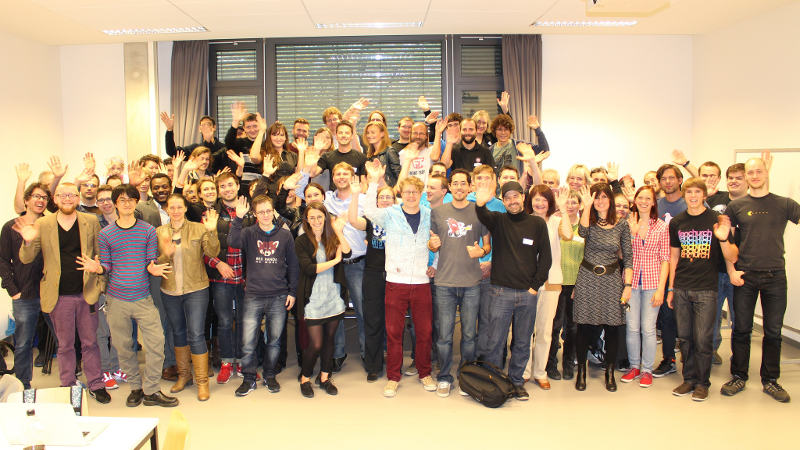

**Berlin, 15. September 2015 – Alles wird vernetzt, auch die Kleidung. Die [Meshcon](http://meshcon.net/), 2014 erstmals als Konferenz für Modemacher und Digital-Kreative gestartet, findet dieses Jahr am Samstag, 3. Oktober im Rahmen der Maker Faire Berlin im Postbahnhof statt. Bei der Neuauflage der Veranstaltung stehen Vorträge und Workshops zur digitalen Vernetzung im Mittelpunkt. Ein besonderer Fokus liegt dabei auf unterschiedlichen Einsatzmöglichkeiten von Open Source-Technologien, vor allem in der Textilwirtschaft. Organisationspartner der Veranstaltung ist der FFII e.V.**

„Die Meshcon will Modedesignern, Technologie-Experten und Softwareentwicklern eine Plattform bieten, um sich über neue Ideen **individualisierter Mode** auszutauschen. Dabei spielt die Steuerung von Strickmaschinen über Minicomputer wie dem Arduino oder Raspberry Pi, Körperscans über 3D-Apps und virtuelle Umkleidekabinen eine genauso große Rolle wie das Einnähen von WLAN-Modulen oder LED-Lichttechnik in Jacken und Pullovern“, erläutert Mario Behling, Veranstalter der Meshcon. „Das Konzept der Maker Faire, die sich als kreatives Do-it-Yourself-Veranstaltung für Groß und Klein präsentiert, bietet für die Meshcon einen idealen Rahmen“, so Behling.

Das **Konferenzprogramm** der Meshcon soll alle Technikbegeisterten ansprechen. Zum Thema **Mode und Technologie** führt Andreas Bräu aus Weimar die neueste Version einer **Strick-App** an einer gehackten Heimstrickmaschine vor. Hier können Besucherinnen und Besucher Fotos einscannen und individuelle Schals ausstricken. Dazu wird eine Strickmaschine mit Hilfe der Software Knitapps mit dem Computer, Smartphone oder Tablet verbunden. Um die Ansteuerung der Nadeln und Bewegung des Schlittens kümmert sich ein Arduino-Mikrocontroller. Anna Schubert zeigt anhand einer Demo, wie man Menschen und Kleider digital und in 3D simulieren und zu einem virtuellen Fitting-Tool zusammenbringen kann.

Willi Döring, aka Neurofox, präsentiert ein **Open-Design-Kopfband als Wearable**. Die eingenähten Sensoren können Gehirnwellen analysieren, die Körperdaten aufzeichnen und auswerten. Das Kopfband wärmt nicht nur, sondern liefert dem Träger auch wissenschaftliche Erkenntnisse.

Weitere **Vorträge auf der Meshcon** drehen sich um

- **3D Bekleidungsvisualisierung und Konfiguration**  mit Anna Schubert (Gründerin von Admoreal), wo es darum geht, Kleidung online und digital anprobieren und personalisieren zu können.
- **Loklak**, ein Webdienst der das Internet der Dinge mit Twitter zusammenschließt und wo z.B. in Kleidung eingenähte Sensoren sich mit dem Web verbinden und dann interessante Daten auf Karten angezeigt werden mit Michael Christen
- das webbasiertes Augmented-Reality-Projekt “Twitch Reality Builder”, das Programmierer Felix Klee unter dem Motto „Die Gamification der Realität“ diskutiert
- Blitz ausgebende Teslaspulen, die über einen Ganzkörperanzug gesteuert werden, vorgestellt von Entwickler Jon Nordby.

Ergänzt wird das Meshcon-Programm durch Workshops. Zu den Angeboten zählen ein **Maschinenstrickworkshop** und **zwei Programmier-Workshops.** Mitarbeiterinnen und Mitarbeiter von **Awesome Shields** und von [**CoderDojo**](http://coderdojo.com/) vermitteln **Programmieranfängern und Kindern** von 5 bis 17 Jahren den Spaß am Programmieren und Hardware bauen.

Presseakkreditierung ab unter folgendem Link erreichbar: [https://ticketing.ticketpay.de/U9SBWI9D](https://ticketing.ticketpay.de/U9SBWI9D)

Link: [http://meshcon.net](http://meshcon.net) | [http://fashiontec.org](http://fashiontec.org)
