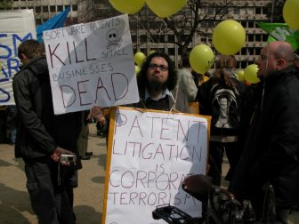

(Minimalist english version [here](http://blog.ffii.org/demonstration-against-unitary-software-patents-thursday-12-dec-in-brussels/))

FFII appelle à manifester contre le Brevet Logiciel Unitaire, la troisième tentative de valider les brevets logiciels en Europe. Les Brevets Logiciels sont des dangers pour les petites entreprises du secteur, qui ne peuvent se défendre. La Cour UPC est une cour internationale captive située au dehors de l'Union Européenne, et qui aura le dernier mot sur la question des brevets logiciels. La Cour UPC favorisera les "trolls des brevets" qui volent nos emplois.

## En pratique

- **Lieu**: Parlement Régional Bruxellois, Rue du Lombard 69, 1000 Bruxelles
- **Heure**: jeudi 12 décembre de 12H00 à 14H00
- **Consignes**: pensez à prendre un trousseau de clefs qui fait du bruit, les clefs du royaume
- **Organisateur**: Benjamin Henrion, FFII eV, @zoobab
- **Contact:** zoobab at gmail.com, +32 484 566109
- **Tshirts**: nous amenerons des tshirts jaunes "NO Unitary Software Patents"

## Pourquoi faut-il rejeter le Brevet Unitaire?

1\. Les entreprises et professionels de l'informatique sont inquiètes des milliers de brevets logiciels délivrés par l'Office Européen des Brevets (OEB) contre l'esprit de la Convention sur les Brevets Européens (CBE article 52.2). La future Cour du Brevet Unifié représente un point de défaillance qui pourra installer une jurisprudence en faveur de la brevetabilité des logiciels à l'échelle européenne, et ce en utilisant des échappatoires telles que l' ["effet technique"](https://www.nextinpact.com/archive/33248-FFII-APRIL-brevet.htm) ou "en tant que tel";

2\. Les entreprises sont inquiètes de la multiplication des menaces et procès faits par certaines entreprises et particulièrement celles qui ne produisent rien d'autre que des brevets (aussi appelée "Trolls des Brevets", "Patent Trolls" ou "Non Practising Entitities"); Nous sommes préoccupés que les brevets logiciels détournent les budgets normalement alloués au développement en R&D (Recherche & Développement), qui employe des développeurs, vers la P&L (Patents & Litigation, Brevets & Contentieux), qui finance des avocats.

3\. Le Brevet Unitaire n'a pas été pensé pour les petites entreprises. Les PMEs n'ont pas les moyens financiers et humains de se défendre devant une cour de justice, ni de payer des dommages et intérêts. Le Brevet Unitaire va aggraver la situation. Le coût du contentieux et le montant des dommages demandés seront à la hausse, car ils seront calculés sur l'ensemble du marché unique. Le coût en frais de procédure pourrait être doublé voire triplé, comme le prédit l'association pharmaceutique EFPIA ([http://epla.ffii.org/analysis#toc3](http://epla.ffii.org/analysis#toc3)): "le coût du contentieux dans un système de cours centralisées serait le double du coût des procédures en France ou en Allemagne, et si la majorité des brevets sont en pratique déposés uniquement dans un seul pays, alors le contentieux obligatoire d'une cour centralisée va uniquement augmenter les coûts sans avantages discernables". En Europe, 90% du contentieux se passe dans un pays uniquement, et seulement 10% du contentieux des brevets concerne des disputes sur plus d'un pays. La majorité des cas vont donc souffrir d'une augmentation du coût d'entrée, éloignant en plus les PMEs du système judiciaire.

4\. De nombreux experts dans le domaine ont reconu que le Brevet Unitaire est le véhicule parfait pour valider les brevets logiciels en Europe (voir [http://epla.ffii.org/quotes](http://epla.ffii.org/quotes)). La sulfureuse directive sur les Brevets Logiciels a été rejetée par le Parlement Européen en 2005 à la demande des grandes multinationales du logiciel qui ont préféré appeller à pousser pour une cour centrale. David Sant, ancien lobbyiste de l'OEB disait même: "The acrimonious debate over the proposed directive on computer-implemented inventions might never have arisen if the patent litigation system in Europe had been unified, thereby eliminating the possibility of disparate national rulings on the same patent matter."

5\. La Cour du Brevet Unitaire sera plus attractive aux trolls qui cherchent à monétiser leurs brevets, à cause des injonctions pan-européennes et des dommages pan-européens. Ils seront capables d'extraire de grands montants d'argent. Les entreprises qui n'ont pas les moyens de défendre devant la Cour (la majorité des PMEs) seront forcées de faire un accord à l'amiable et de payer; La majorité des disputes de brevets n'apparaissent jamais devant une cour de justice.

6\. L'UPC est un instrument anti-démocratique, dont les 130 pages des règles de procédure de la Cour n'ont pas été écrites ni ratifiées par les Parlements, y compris le Parlement Européen, mais par un comité administratif populé par des membres non-élus de l'industrie des brevets; ceci est contraire à l'article 6 de la ECHR, qui indique dans sa jurisprudence que les cours de justices ne peuvent être établies que par des parlements élus. Ce comité administratif aura aussi le pouvoir de changer le traité à sa guise sans consulter aucun parlement une fois que le Brevet Unitaire est en marche; Les Parlements (européen et nationaux) n'ont jamais eu l'opportunité ni la compétence ni la procédure pour discuter ou amender ces règles de procédure; les citoyens et les entreprises n'ont pas de levier démocratique afin d'influencer cette importante pièce de règlement;

7\. Nous pensons que le Brevet Unitaire n'est pas contre-balancé par un parlement élu, même pas le Parlement Européen, transformant cette Cour en quasi-législateur en matière du droit des brevets;

8\. Rien n'empèchera la Cour du Brevet Unitaire d'interpreter l'exclusion des programmes d'ordinateur de manière étroite, et d'utiliser l'excuse "trou noir" de "l'effet technique", un concept fallacieux créé par l'Office Européen des Brevets pour délivrer les brevets logiciels même si le traité les interdit;

9\. La Cour sera populée en partie par des juges techniques, qui n'ont pas de diplômes de droit, et qui sont des anciens avocats en brevets (patent attorneys, patent counsels), entrainés à l'écriture la plus large possible des brevets.

10\. Le Brevet Unitaire va participer à l'inflation du nombre de brevets ("global patent warming"), qui vont grossir encore plus les caisses de l'Office Européen des Brevets qui s'auto-finance et grossit grâce à ces redevances annuelles. L'OEB a donc un intérêt financier direct dans l'inflation du nombre de brevets.

11\. Le Brevet Unitaire rendra impossible les clarifications nationales de la Convention Européenne des Brevets, comme demandé par de précédents acteurs;

12\. Le Brevet Unitaire permettra la bifurcation, qui sépare la procédure de validité de la procédure de contrefaçon (comme en Allemagne), créant un déséquilibre, où le possesseur du brevet dit d'un coté que son brevet est large (contrefaçon), et de l'autre qu'il est étroit (validité). Des injonctions pour stopper des produits du marché sont données, alors que le brevet est déclaré plus tard non valide!

13\. Le Brevet Unitaire est une prise de pouvoir de la communauté des brevets, car les juges seront élus dans cette communauté. Le droit des brevets sera déséquilibré par rapport à d'autres parties du droit, et aucune Cour Suprême ni la Cour Européenne de Justice (CJEU) ne pourra intervenir dans le droit des brevets afin de corriger leurs pratiques déviantes, comme cela se passe depuis une dizaine d'années aux Etats-Unis où la Cour Suprème américaine (SCOTUS) mène un match avec un score de 10:0 contre la Cour Spécialisée en Brevets (CAFC). Le droit des brevets évoluera dans sa propre bulle ou avec une 'vision myope de la loi': "La loi des brevets ne vit pas dans l'isolement et le silence d'un monastère trappiste. Elle fait partie d'un ensemble de lois. Elle exerce son ministère sur un système de monopoles au sein d'un système concurrentiel plus vaste" (Rifkind, 1951)

14\. Il faut réécrire le projet du Brevet Unitaire afin de l'intégrer dans les structures de l'Union Européenne, et de migrer l'institution non démocratique de l'Office Européen des Brevets (OEB) dans une agence de l'Union Européenne, sous la compétence unique du Parlement Européen. L'OEB est une organisation internationale qui abuse de son immunité diplomatique, et qui ne peut être poursuivie pour mauvaise administration ("rule of law").

15\. Le Parlement Bruxellois devrait inviter des experts sur ces questions sensibles, et attendre la décision de la Cour Suprème Allemande, qui traite de nombreux points légaux soulevés, et qui sera annoncée dans le premier tiers de 2020.

16\. Le Parlement Bruxellois devrait escalader les problèmes constitutionnels liés au Brevet Unitaire à la Cour Constitutionnelle de Belgique, tels que:

\[1\] les règles de procédure de la cour non établies et ratifiées par des parlements, contrairement à l'article 6 ECHR et à la jurispridence belge;

\[2\] la discrimination des langues - les néérlandophones ayant une version légalement non-liante avec Google Translate, alors que les francophones auront une version légalement liante;

\[3\] "état de droit" ou "rule of law": l'administration de l'OEB n'est pas poursuivable devant la justice pour mauvaise administration (affaire Wallinger en attente devant la Cour Constitutionnelle Allemande, voir [https://is.gd/PN0zHC](https://is.gd/PN0zHC)): _"the Opposition Division of the European Patent Office revoked the Patent in Oral Proceedings because both judges preferred to watch football games at the World Championship in South Africa instead of discussing legal matters."_

La plainte devant la Cour Constitutionnelle 2015 déposée par ESOMA asbl en 2015 n'avait pas été examinée sur le fonds par la Cour car déposée en dehors des délais de 6 semaines pour un traité international contre 6 mois pour une loi normale ([https://is.gd/1mmc3c](https://is.gd/1mmc3c) ou [http://esoma.wdfiles.com/local--files/forum%3Athread/recours-unitary-patent-belgian-constitution.pdf](http://esoma.wdfiles.com/local--files/forum%3Athread/recours-unitary-patent-belgian-constitution.pdf)) .

17\. Si la Cour UPC avait été installée sous l'égide de l'Union Européenne, il n'y aurait pas eu besoin d'écrire un protocole pour créer un nouveau statut d'immunité diplomatique, car l'UE dispose d'un statut propre déjà existant pour les membres de ses équipes.

18\. L'association "NoPatentsOnSeeds" qui défend le droit des agriculteurs et des éleveurs a les mêmes préoccupations concernant le Brevet Unitaire: https://www.no-patents-on-seeds.org/en/information/news/stop-eu-unitary-patent
