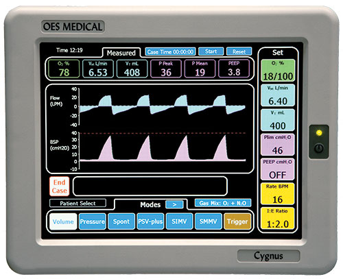
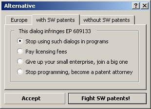

**Brussels, 1st April 2020 -- The Unified Patent Court (UPC) has issued a pan-European injunction to halt the sales of ventilators across Europe. The Court ruled that ventilators used by hospitals in the current pandemic of COVID-19 were violating an EPO patent on graphical user interfaces using tabs, granted to Bulldog Diagnostics LLC. Despite the lockdown, crowds started assembling around EPO offices, and the protests quickly escalated into violent riots. Protesters said that patent law cannot live in its own bubble, that lives were more important than profit.**

__

_An_ _OES CYGNUS Anaesthesia Ventilator using tabs (ref: https://www.oes-medical.co.uk/cygnus/ )_

_EPO patent EP 689133 on Tabbed panels_

James Live, of Ecologic International: _"Halting sales of life-saving devices in a middle of a pandemic is a criminal act. But this Unified Patent Court sits in the international waters, so they are out of reach. Patent law is living in a parallel universe, outside of the European Union and the European Court of Justice. The European Parliament and other national parliaments have committed suicide by transferring their national courts to this puppy court system."_

Francesca Minarogance, spokeswoman of Bulldog Diagnostics LLC: _"Ventilators manufacturers should respect patent law, we hope they will all take a license with this decision. Respect for IP!"_

Alberto Piedra, who is developing open source ventilators in Spain: _"I am happy Spain is not part of the Unitary Patent and the Unified Patent Court, but the PSOE is pushing for it. We can still save lives here with our open source ventilator."_

A demonstrator outside the offices of the EPO in Munich shouted "EPO must GO!" explaining that the patent office was outside of the European Union, and should become an EU agency, where the European Parliament have democratic oversight. 

An EPO spokesmen said: _"The exclusion of patentability for 'presentation of information' has to be interpreted 'as such'. The caselaw of the Boards of Appeal says that graphical user interfaces are patentable if they produce a technical effect in the brain of the nurses and doctors. We are happy that this specialized patent court has adopted our doctrine, installing a jurisprudence for Computer Implemented Inventions (CIIs) in Europe without a debate in parliaments."_

FFII President, Peter Highness, finishes: _"After ventilators, this patent troll will go after Apple and its iPhones, so Millenials and GenZs, be prepared and make your stock! Empty stocks of toilet paper was just the beginning, who can survive in those pandemic times without an iPhone and an internet connection?"_

### Links

- KluwerPatentBlog: Industry group: ‘Unified Patent Court hands patent trolls a powerful weapon’:   
    [http://patentblog.kluweriplaw.com/2017/04/23/industry-group-unified-patent-court-hands-patent-trolls-a-powerful-weapon/](http://patentblog.kluweriplaw.com/2017/04/23/industry-group-unified-patent-court-hands-patent-trolls-a-powerful-weapon/)
- Pluralistic: Lax antitrust killed ventilator stockpiles: [https://pluralistic.net/2020/03/30/medtronic-stole-your-ventilator/#market-oxygen](https://pluralistic.net/2020/03/30/medtronic-stole-your-ventilator/#market-oxygen)
- OES Cygnus Anaesthesia Ventilator_:_ [https://www.oes-medical.co.uk/cygnus/](https://www.oes-medical.co.uk/cygnus/)
- Tabbed panes: [https://en.wikipedia.org/wiki/Tab\_(interface)](https://en.wikipedia.org/wiki/Tab_(interface))
- Techdirt: SoftBank Owned Patent Troll, Using Monkey Selfie Law Firm, Sues To Block Covid-19 Testing, Using Theranos Patents: [https://www.techdirt.com/articles/20200316/14584244111/softbank-owned-patent-troll-using-monkey-selfie-law-firm-sues-to-block-covid-19-testing-using-theranos-patents.shtml](https://www.techdirt.com/articles/20200316/14584244111/softbank-owned-patent-troll-using-monkey-selfie-law-firm-sues-to-block-covid-19-testing-using-theranos-patents.shtml)
- ESR-Pollmeier: Should we patent EP 689133 tabbed palettes? [https://www.esr-pollmeier.com/swpat/ESR\_Pollmeier\_SWPat\_ZVEI\_2002-06-05\_EN.pdf](https://www.esr-pollmeier.com/swpat/ESR_Pollmeier_SWPat_ZVEI_2002-06-05_EN.pdf)
- Vrijschrift: Software patents in daily life [https://old.vrijschrift.org/swpat/press/eu\_voting\_030901.en.html](https://old.vrijschrift.org/swpat/press/eu_voting_030901.en.html)
- Labrador Diagnostics LLC Vs Biofire Diagnostics LLC and Biomerieux SA: [https://regmedia.co.uk/2020/03/18/theranos.pdf](https://regmedia.co.uk/2020/03/18/theranos.pdf)
- Pieter Hintjens says we don't have enough oxygen machines for everybody: [https://twitter.com/zoobab/status/1238459322818015232](https://twitter.com/zoobab/status/1238459322818015232)
