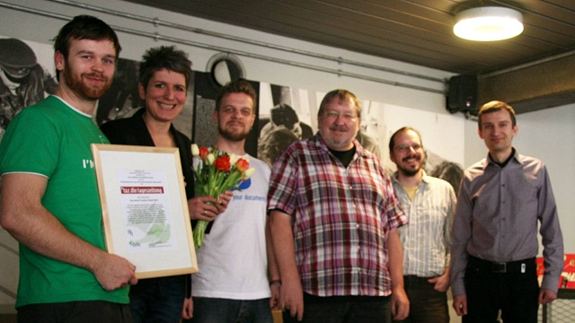

**Berlin, 27 March 2013 -- The German newspaper taz.die tageszeitung (TAZ) receives this year's Document Freedom Day award. With this award, the Free Software Foundation Europe (FSFE) and the Foundation for a Free Information Infrastructure (FFII) honour organisations that make exemplary use of Open Standards.**

Torsten Grote (FSFE), Ines Pohl (taz), Erik Albers (FSFE), Ralf Klever (taz), Frank Doepper (taz), Stephan Uhlmann (FFII

The TAZ receives the Document Freedom award because it delivers its electronic paper to its subscribers in a choice of open formats, and without digital restrictions (DRM). _"We are awarding the TAZ with the Document Freedom Award for their longstanding commitment to Open Standards and continuos efforts in offering their newspaper without restrictions"_ says Erik Albers, Fellowship Coordinator Berlin.

TAZ subscribers can receive their paper in HTML, PDF, ePub, and even plain text formats. HTML files form the basis of the World Wide Web. The Portable Document Format (PDF) was published as a standard by the International Organization for Standardization (ISO) in 2008. Adobe has granted anyone the right to make and distribute PDF files without restrictions. Plain text files (.txt) can easily be read or opened by any thousands of applications, independent of any platform, product, or vendor. _"Plain text files have great benefits for libraries,"_ highlights Elisabeth Klein, a humanities scholar with close connections to academic libraries in Germany. _"They can offer easy access to works using a lot of different devices. Users and researchers can efficiently search and analyse them."_

ePub is an Open Standard for electronic books. Rather than being bound to a particular vendor, users can open files with the .epub extension with a wide range of programs and devices. _"We use Free and Open formats, because we don't like to put our readers in a cage - even it it's made of gold. Only by using Open Standards without DRM we are able to spread TAZ news media as widely as possible"_ says Ralf Klever, Head of IT in the TAZ.

Stephan Uhlmann, FFII board member, adds: _"We congratulate TAZ for their firm stance on the usage of Open Standards. The TAZ has a history of covering contemporary political movements very closely, which makes this an important contribution to preserve this documentation in open and accessible document formats for future generations."_

Document Freedom Awards are given annually on Document Freedom Day - the international day for Open Standards. Previous winners include 1&1 Internet AG, tagesschau.de and Deutschland Radio.

### Links

- Press pictures of the award ceremony
    
    [https://wiki.fsfe.org/DFD-2013-Berlin](https://wiki.fsfe.org/DFD-2013-Berlin)
    
- Document Freedom Day - Celebrating information accessibility and raising awareness of Open Standards
    
    [http://documentfreedom.org](http://documentfreedom.org)
    
- FFII's Open Standard definition and working group
    
    [http://action.ffii.org/openstandards](http://action.ffii.org/openstandards)
    
- Permanent link to this press release
    
    [http://press.ffii.org/Press\_releases/taz.die\_tageszeitung\_receives\_Document\_Freedom\_Germany\_Award](http://press.ffii.org/Press_releases/taz.die_tageszeitung_receives_Document_Freedom_Germany_Award)
    

### Press contacts

Stephan Uhlmann Foundation for a Free Information Infrastructure Malmöer Str. 6 10439 Berlin Tel: +49-30-41722597 Mobile: +49-170-4225008

## About the Document Freedom Day

Document Freedom Day (DFD) campaigns to celebrate information accessibility and introduce non-technical audiences to Open Standards. Open Standards are a basic condition for freedom and choice in software; ensuring the freedom to access data, and the freedom to build Free Software to read and write information. Started in 2008, the campaign has resulted in hundreds of events worldwide.

[http://documentfreedom.org/](http://documentfreedom.org/)

## About the Free Software Foundation Europe

The Free Software Foundation Europe (FSFE) is a non-profit non-governmental organisation active in many European countries and involved in many global activities. Access to software determines participation in a digital society. To secure equal participation in the information age, as well as freedom of competition, the Free Software Foundation Europe (FSFE) pursues and is dedicated to the furthering of Free Software, defined by the freedoms to use, study, modify and copy. Founded in 2001, creating awareness for these issues, securing Free Software politically and legally, and giving people Freedom by supporting development of Free Software are central issues of the FSFE.

## About FFII

The FFII is a not-for-profit association registered in twenty European countries, dedicated to the development of information goods for the public benefit, based on copyright, free competition, open standards. More than 1000 members, 3,500 companies and 100,000 supporters have entrusted the FFII to act as their voice in public policy questions concerning exclusion rights ("intellectual property") in data processing.
