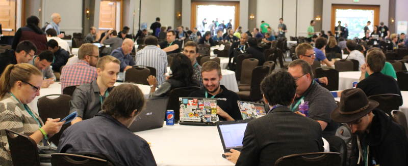
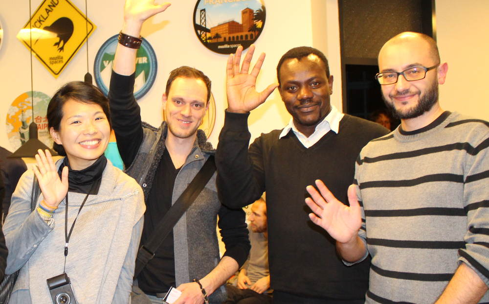
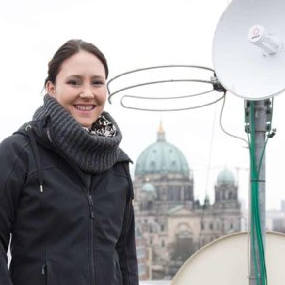

The [OpenTechSummit](http://opentechsummit.net) will take place for the first time in Berlin on May 14, 2015 with the [Foundation for a Free Information Infrastructure](http://ffii.org) as a core partner and supporter. The Free and Open Source technology event brings together policy makers, developers, start-ups, and contributors. Topics at the OpenTechSummit range from future technologies, open hardware, encyclopedias, open data and free knowledge, software development, community networks and digital policies. In the evening there will be an “OpenTech-Himmelfahrt” lounge.

The FFII is the main responsible for the track “Internet, Society and Patents”. The track covers policy topics ranging from patents, copyright, net neutrality, privacy issues, digital culture and Internet policies.

[Get your ticket now](http://ots15.eventbrite.com) and join our Berlin [meetup group](http://www.meetup.com/OpenXLab/) to participate in workshops and hackathons all year around.

[Become a speaker](http://opentechsummit.net/speaker-registration/): We are looking for speakers from our community who are interested to share their knowledge knowledge and experience. Please register as a speaker at: [opentechsummit.net/speaker-registration/](http://opentechsummit.net/speaker-registration/)

Talks, workshops and panels will take place all day long in five different tracks at the event.

In a barcamp style track there is space for adhoc meetings, lightning talks and breakout session.

There are workshops for technology enthusiasts of all ages. And there are hands-on hardware workshops particularly for the young ones.

\--

Tickets

Tickets are available for community participants, developers and the general public. Kindly note that business tickets with additional benefits and social event tickets are available too. Get your ticket at: [http://ots15.eventbrite.com](http://ots15.eventbrite.com)

\--

OpenTechSummit’15

Date and Location: Thu, 14th May 2015 - Kalkscheune Johannisstrasse 2, 10117 Berlin

Program: Talks and Workshops 9 - 5.30om | Social Lounge: 6-10pm

Tickets: [http://ots15.eventbrite.com](http://ots15.eventbrite.com)

Read the [Call for Speakers here](http://opentechsummit.net/CallSpeakers.pdf).

More info on the OpenTechSummit 2015 at the [Event Website](http://opentechsummit.net)

\--

About the OpenTechSummit

The goal of the OpenTechSummit is to offer participants a platform to learn about future technologies and meet leading Open Source experts and policy makers who share their insights, ideas and success stories. The OpenTechSummit is run as a non-profit event in cooperation with the Foundation for a Free Information Infrastructure, which is also funding parts of the event. Other partners are the Förderverein Freie Netze e.V. and the Linuxtag e.V. Regular [OpenTech Meetups](http://www.meetup.com/OpenXLab/) take place in Berlin and around the world. The first OpenTechSummit was held in Taiwan 2009. The organization team brings together Monic Meisel (Freifunk), André Rebentisch (FFII e.V.) and [Mario Behling](http://twitter.com/mariobehling) (FashionTec/OpenXlab Berlin) and Iris Wessolowski (Social Media & Community).

\--

We are happy to welcome journalists covering the event. Please register at: [http://tinyurl.com/mcpress](http://tinyurl.com/mcpress)

\---

Twitter: [https://twitter.com/opntec](https://twitter.com/opntec)  Hashtag: #ots

Meetup-Gruppe: [http://www.meetup.com/OpenXLab/](http://www.meetup.com/OpenXLab/)

Pictures: [https://www.flickr.com/search/?q=openxlab](https://www.flickr.com/search/?q=openxlab)

Facebook: [https://www.facebook.com/OpenTechSummit](https://www.facebook.com/OpenTechSummit)

Newsletter: [http://opentechsummit.net/#newsletter](http://opentechsummit.net/#newsletter)
