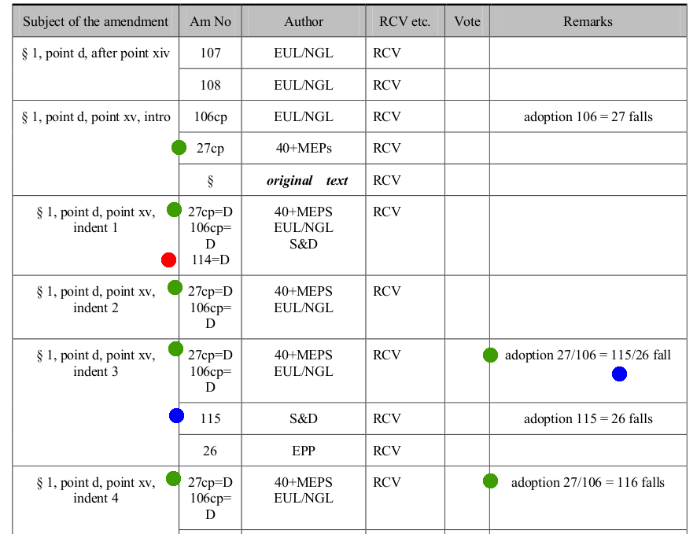

Wednesday the European Parliament would have voted on TTIP, a trade agreement with the United States under negotiation. The voting list for the resolution did not list a vote on amendment 114. After being alerted rapporteur Lange did not act on this. Arguably, Mr Lange did not avoid appearance of conflict of interest.

Amendment 114 could have been an important amendment as it aims at removing support for Malmström's ISDS plans (which include [very broken ISDS in the agreements with Canada and Singapore](https://blog.ffii.org/seven-things-you-should-know-about-eu-singapore-isds/)).

**Banana Union?**

Strange things sometimes happen in the European Parliament. After the plenary vote on IPRED2 an [amendment, adopted in plenary, disappeared](http://action.ffii.org/ipred2/Mistake%20in%20EP%20provisional%20consolidated%20text%20Criminal%20Measures%20IP%20directive). Only after the IPRED2 rapporteur left the Parliament the Parliament restored it - a year later.

In the orphaned works directive process [too many Members voted](http://tacd-ip.org/archives/602) in the legal affairs committee, changing the majority. The Parliament never corrected this.

It is important to monitor voting.

**A missing amendment!**

On Tuesday I alerted Bernd Lange, rapporteur for TTIP, Steven Wicker, head of the tabling desk, Martin Schulz, president of the EP, and several Members of Parliament that a vote on amendment 114 was missing.

I did not get a reaction. I called Lange's office. The assistant denied there was something wrong. A few hours later the vote on TTIP was postponed (as there was a serious chance that the Parliament would have opposed ISDS).

**The voting list**

The voting list disappeared from the EP website; as the vote was postponed that is only natural. Here is [a mirror](http://people.ffii.org/~ante/ttip/TTIP-voting-list-2015-06.pdf). Here is a screen shot of the important part:

See amendment 27cp, at the green dots in the screen shot. Amendment 27 has 5 effects. It changes the wording of "§ 1, point d, point xv, intro", and it deletes four indents. The voting list indicates that with "§ 1, point d, point xv, indent 1" "27cp=D", etc.

Amendment 27 is mutually exclusive with amendments 115 and 26. We see that in the last column. If 27 is adopted 115 and 26 fall.

("cp" stands for cross-party)

There are two blue dots for amendment 115. In the remarks we see that it falls if 27 is adopted (for simplicity I leave 106 out of the story).

If that did not happen, there is a vote on 115; the other blue dot.

Now search for amendment 114 - it has a red dot. The voting list correctly says that if 114 is adopted "§ 1, point d, point xv, indent 1" is deleted ("114=D"). But amendment 114 can not have this effect without a prior vote.

Where is the vote on amendment 114? Nowhere.

Unlike with amendment 115, there is only one red dot. The voting list does not list a vote for amendment 114.

Furthermore, if amendment 27 is adopted, "§ 1, point d, point xv, indent 1" is already deleted. So the voting list should also have said that 114 falls if 27 is adopted. But "adoption 27/106 = 114 falls" is not in the document.

The voting list is wrong. Votes in the Parliament often go fast. There is a serious chance that amendment 114 would have been overlooked.

**A careless rapporteur**

The social democrats only tabled 3 amendments. And they didn't even carefully check these 3 amendments on the voting list.

Rapporteur Lange acted careless regarding an amendment - his own - that would have removed support for Malmström's ISDS plans (which include very broken ISDS in the agreements with Canada and Singapore).

Arguably, Lange had a personal interest.

The EPP (the biggest group) threatened to vote against the resolution as a whole if the resolution including amendments opposed ISDS. Lange, rapporteur for the resolution (the Member guiding it through Parliament) would have lost "his" resolution.

To get the resolution through the international trade committee Lange made a deal with the EPP. The trade committee text did not oppose ISDS, and even supported Malmström's approach.

**Rebellion**

Hell broke loose in his own social democratic group as Lange's compromise was not in line with his group's approach.

By avoiding a vote on amendment 114 Lange could avoid the EPP voting against the resolution as a whole. His resolution would have been safe.

Lange could have avoided this appearance of conflict of interest by being more careful.

Then the situation changed dramatically. Social democrats rebelled. There was a serious chance that the Parliament would adopt amendment 27, [which clearly opposes ISDS](https://blog.ffii.org/sd-isds-amendments-are-seriously-broken/). The President postponed the vote.

Democracy is alive, the situation is critical.
