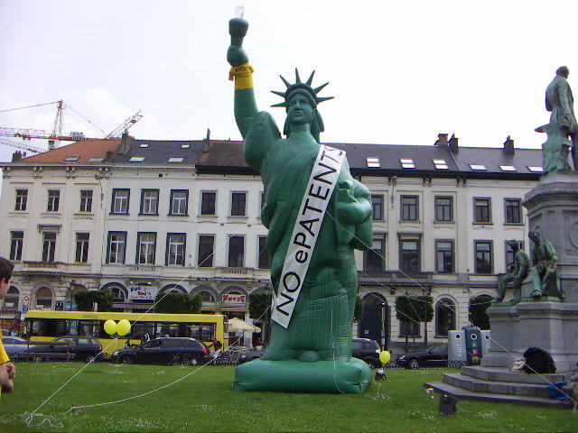
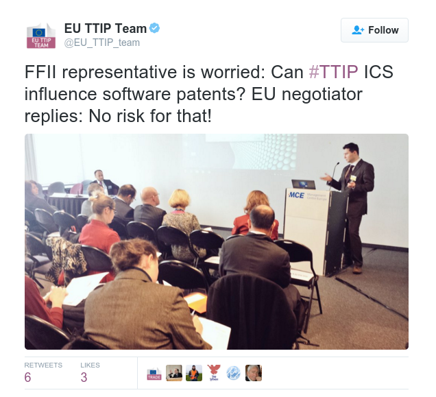

\[caption id="attachment\_4327" align="alignnone" width="640" caption="No Software Patents"\]\[/caption\]

Companies could use [investor-to-state dispute settlement](https://blog.ffii.org/eu-commission-isds-proposal-a-threat-to-democracy-and-civil-rights/) (ISDS) in trade agreements to challenge refusals to grant software patents, FFII's Benjamin Henrion argued during the 24 February 2016 [TTIP stakeholder's presentations](http://trade.ec.europa.eu/doclib/docs/2016/february/tradoc_154316.pdf). Successful challenges could undermine the European Patent Convention's [exclusion of software](https://www.epo.org/law-practice/legal-texts/html/epc/2013/e/ar52.html), the recent US Supreme Court's limits on patentability, and [Congressional patent reform](http://techcrunch.com/2015/09/13/patent-reform-tries-again/).

Henrion noted that the SME where he worked had to fire ten software developers after a major customer was attacked by a [patent troll](https://en.wikipedia.org/wiki/Patent_troll) and discontinued a project.

[US research shows](https://hbr.org/2014/07/the-evidence-is-in-patent-trolls-do-hurt-innovation/) that patent trolls cost defendant firms $29 billion per year in direct out-of-pocket costs; in aggregate, patent litigation destroys over $60 billion in firm wealth each year.

In 2005 the European Parliament overwhelmingly [rejected](http://www.ft.com/intl/cms/s/2/028f5b2e-ee43-11d9-98e5-00000e2511c8.html) the [software patents directive proposal](http://en.swpat.org/wiki/EU_software_patents_directive). During the preceding debates proponents of software patents argued that not granting software patents is a [violation](https://en.wikipedia.org/wiki/Software_patents_under_TRIPs_Agreement) of the Agreement on Trade-Related Aspects of Intellectual Property Rights' (TRIPS), [art 27](https://www.wto.org/english/docs_e/legal_e/27-trips_04c_e.htm) (1) "patents shall be available for any inventions, whether products or processes, in all fields of technology". While states may not want to limit each others policy space using WTO state-state dispute settlement (as they would limit their own as well), companies do not have restraint regarding states' policy space.

**Eli Lilly versus Canada**

In 2012 Henning Grosse Ruse - Khan noted that the Eli Lilly versus Canada ISDS case reveals an interesting [new interface between international intellectual property (IP) and investment law](http://worldtradelaw.typepad.com/ielpblog/2012/12/investor-state-arbitration-to-challenge-host-state-compliance-with-international-ip-treaties.html). Eli Lilly claims that Canada's refusal to grant two pharmaceutical patents violates the TRIPS agreement.

**CETA and TTIP**

The FFII noted issues with ISDS tribunals interpreting TRIPS in its [submission](http://people.ffii.org/~ante/ISDS/FFII-ISDS-2014-07-01.html) to the 2014 EU commission's consultation on ISDS. In April 2015 Sean Flynn gave the presentation "[TTIP Stakeholder Statement: Protect IP from ISDS](http://infojustice.org/archives/34319)" in the IP room. However, the issues were not solved in the consolidated EU-Canada (CETA) text, the final CETA text or the TTIP proposal. \[1\]

The texts would give supranational (for-profit) investment adjudicators discretion to interpret and decide on compliance with the TRIPS agreement. The EU TTIP proposal contains some safeguards regarding intellectual property rights, but they still leave investment adjudicators [considerable discretion](https://blog.ffii.org/eu-commission-isds-proposal-a-threat-to-democracy-and-civil-rights/#sec-3-1). This would make it possible for companies to challenge the refusal to grant software patents. ISDS tribunals are known for [expansive interpretation](http://digitalcommons.osgoode.yorku.ca/ohlj/vol50/iss1/6/) of investors rights. \[2\]

**Denial mode**

The EU commission's IP negotiator, Mr Pedro Velasco Martins, said he didn't see a problem, as TTIP will not contain rules on patentability.

In my opinion Velasco Martins missed the point. Henrion's argument is not based on patentability rules in TTIP, but on the discretion to interpret the TRIPS agreement.

Velasco Martins also advised Henrion to read the CETA text. We saw above CETA and the TTIP proposal contain similar issues.

After the presentation the commission [tweeted](http://twitter.com/EU_TTIP_team/status/702447228271661056): "FFII representative is worried: Can #TTIP ICS influence software patents? EU negotiator replies: No risk for that!"

As Velasco Martins' rebuttal failed to convince, I conclude that the tweet spreads wrong information. The commission did not pick up concerns voiced by academics and NGOs. Rather, like earlier with the software patents directive proposal and [ACTA](https://blog.ffii.org/european-parliament-rejects-acta/), the commission is in denial mode.

ISDS in trade agreements with the U.S. and Canada is not needed at all, but does create a serious risk to much needed policy space.

\[1\] The ISDS consultation text was based on a version of the CETA text ([FFII submission](http://people.ffii.org/~ante/ISDS/FFII-ISDS-2014-07-01.html)). [Flynn](http://infojustice.org/archives/34319) discusses the consolidated CETA text. Note Flynn mentions dozens of investment treaties between the U.S. and EU states. There are however only [nine](https://www.tni.org/en/publication/central-and-eastern-european-countries-crossroads) such treaties. The [final CETA text](http://trade.ec.europa.eu/doclib/docs/2016/february/tradoc_154329.pdf) has similar provisions, see articles 8.12 (5) and (6), page 49, and Annex 8-D, page 334. See FFII, [section on IP](https://blog.ffii.org/eu-commission-isds-proposal-a-threat-to-democracy-and-civil-rights/), for the TTIP proposal.

\[2\] ISDS tribunals can award damages including expected profits and interests looking back to the original refusal to grant the patent. High damages could force states to grant patents.
