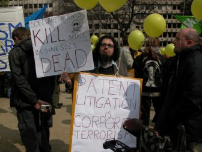

(Version plus complète en français [ici](http://blog.ffii.org/manifestation-contre-le-brevet-logiciel-unitaire-jeudi-12-decembre-a-bruxelles/)) (More complete version in french [here](http://blog.ffii.org/manifestation-contre-le-brevet-logiciel-unitaire-jeudi-12-decembre-a-bruxelles/))

FFII calls to demonstrate against Unitary Software Patents, the third attempt to impose software patents in Europe. Software patents are a threat to small- and medium-sized software companies that cannot defend themselves. The UPC (Unified Patent Court) is an international court made outside of the European Union, which would have the last word over the question of software patenting. The Court would favour "patent trolls" which steal our jobs and extort money.

- **Location**: Parlement Régional Bruxellois, Rue du Lombard 69, 1000 Brussels
- **Time**: thursday 12 december from 12H00 to 14H00
- **Recommandation**: take a ring of keys with you to make noise, preferably the "keys of the kingdom"
- **Tshirts**: we will bring new yellow tshirts “NO Unitary Software Patents”
- **Organisation**: Benjamin Henrion, FFII eV, [@zoobab](https://twitter.com/zoobab)
- **Contact:** zoobab at gmail.com, +32 484 566109

#### Why the Unitary Patent should be rejected?

For good reasons to reject the Unitary Patent, please read the UK petition available here:  
[http://www.nounitarysoftwarepatents.uk/](http://www.nounitarysoftwarepatents.uk/quotes)

Some quotes about the Unitary Software Patents:  
[http://www.nounitarysoftwarepatents.uk/quotes](http://www.nounitarysoftwarepatents.uk/quotes)

What UK software companies say:  
[http://www.nounitarysoftwarepatents.uk/companies-list](http://www.nounitarysoftwarepatents.uk/companies-list)

Old analysis about EPLA, which is still valid:

[http://epla.ffii.org](http://epla.ffii.org)

The french version of this page (Version française [ici](http://blog.ffii.org/manifestation-contre-le-brevet-logiciel-unitaire-jeudi-12-decembre-a-bruxelles/)) has slightly more arguments, but most of them are common. We are looking for translators from french to english to recopy them here.
