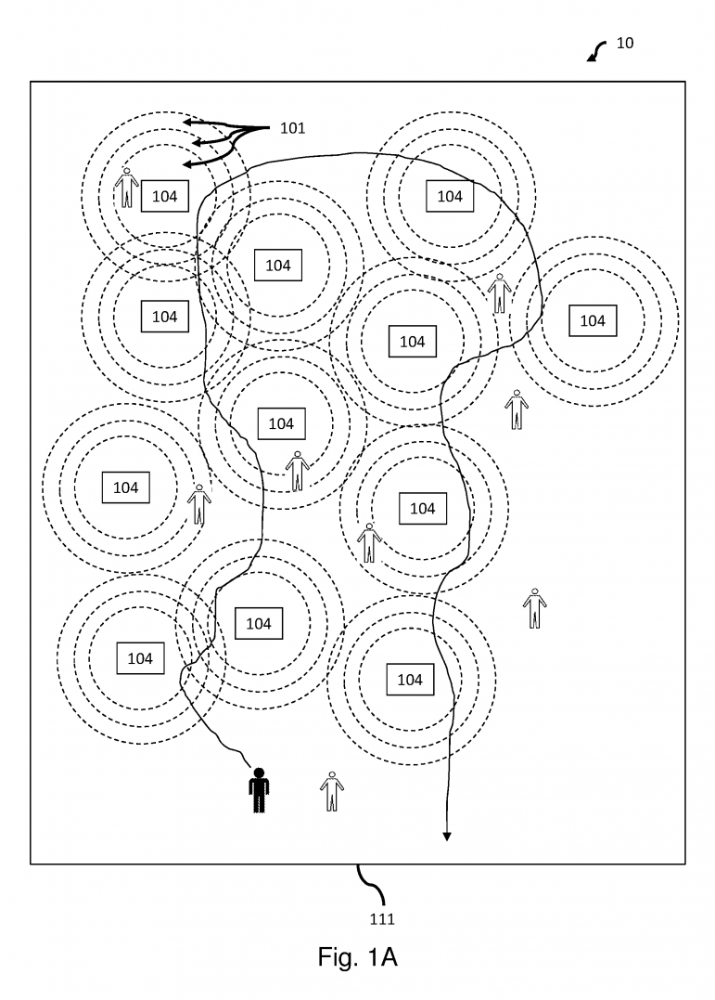

**COVID tracing apps are now under the threat of a software patent in the United States, granted to Blyncsy, a company from Utah. This is the posterchild of an American patent office willfully ignoring the Alice jurisprudence of the Supreme Court, which bans patents on software.**

Blyncsy was granted a patent on February 2019 titled _"Tracking proximity releationships and uses thereof"_ (US10198779B2), which claims _"receiving data about a first person and a second person, the first person having a contagion."_

US10198779B2: Tracking proximity releationships and uses thereof

Blyncsy has opened up a new webpage for collecting royalties, signaling their intention to actively racket other players around this broad and trivial software patent. Their CEO Mark Pittman said:

> _"We have launched the website to streamline the process to make licensing easier. \[...\] We might have to sue people, if companies are making revenue off their app without getting licensed through Blyncsy"_.

Apple and Google have announced OS updates to iOS and Android in order to provide the basic support for such tracing applications, using a decentralized approach (DP-3T).

Benjamin Henrion, President of FFII, comments:

> _"I have recently spent some time programming a cheap smartwatch to help COVID tracing, in order to provide an alternative to Apple and Google, which cannot guarantee privacy and complete auditability of the entire software to their end users. Software patents like this one are nothing else than poison for software development. Any delay in the adoption of tracing will translate into deaths. I profoundly hate companies trying to profit from the current pandemic."_

COVID tracing with a PineTime smartwatch

The American Patent Office, the USPTO, has granted this patent against _Alice_, the established jurisprudence of the Supreme Court which bans patent on software. According to the Electronic Frontier Foundation (EFF), the Patent Office has simply “adjusted” to the Alice Supreme Court ruling by ignoring it:

> Last year, the Patent Office decided to work around that decision, so that the door to bogus software patents could swing open once again. The office issued new guidance telling its examiners how to avoid applying _Alice_.
> 
> \[...\]
> 
> The office and its director, Andre Iancu, refused to adapt its guidance to match the law, even when so many members of the public demanded it.
> 
> \[...\]
> 
> For people who work with technology, the Patent Office’s self-congratulatory report is bad news. It means there will be more abstract software patents, and more patent trolls who exploit them.

In Europe, the EPO has worked around the exclusion of software patents by using the "as such" and "technical effect" loopholes, and the EPO have granted similar patents. While this american patent does not have any european patent application, the minefield created by the EPO is a nightmare for any software developer. The EPO is now trying to validate software patents through the creation of the Unitary Patent Court (UPC), where the European Court of Justice of the European Union (CJEU) won't have a say in patent law, and software patents in particular.

#### Links

- Blyncsy patents [http://www.blyncsy.com/patents](http://www.blyncsy.com/patents)
- Blyncsy Announces Launch of Contact Tracing Licensing Request Website [https://www.yahoo.com/lifestyle/blyncsy-announces-launch-contact-tracing-154500268.html](https://www.yahoo.com/lifestyle/blyncsy-announces-launch-contact-tracing-154500268.html)
- EFF: The Patent Office Is “Adjusting” to a Supreme Court Ruling by Ignoring It [https://www.eff.org/fr/deeplinks/2020/05/patent-office-adjusting-supreme-court-ruling-ignoring-it](https://www.eff.org/fr/deeplinks/2020/05/patent-office-adjusting-supreme-court-ruling-ignoring-it)
- Bloomberg: Startup Risks Clash With Apple, Google Over Virus-App Royalties [https://news.bloomberglaw.com/coronavirus/startup-seeks-royalties-from-google-apple-covid-tracking-apps](https://news.bloomberglaw.com/coronavirus/startup-seeks-royalties-from-google-apple-covid-tracking-apps)
- Mediapost: Startup Prepares To Battle Apple, Google Over COVID-19 Tracing Patent Rights [https://www.mediapost.com/publications/article/351168/startup-prepares-to-battle-apple-google-over-covi.html](https://www.mediapost.com/publications/article/351168/startup-prepares-to-battle-apple-google-over-covi.html)
- US10198779B2: Tracking proximity relationships and uses thereof [https://patents.google.com/patent/US10198779B2/en](https://patents.google.com/patent/US10198779B2/en)
- FFII: EU Software Patent Court stopped by Constitutional Court, patent industry will try again [https://ffii.org/eu-software-patent-court-stopped-by-constitutional-court-patent-industry-will-try-again/](https://ffii.org/eu-software-patent-court-stopped-by-constitutional-court-patent-industry-will-try-again/)
- COVID smartwatch implementing DP-3T based on nRF52 and Dyne firmware [https://twitter.com/zoobab/status/1255034319652913152](https://twitter.com/zoobab/status/1255034319652913152)
- COVID smartwatch and Dyne's Decode Proximity firmware: [https://github.com/dyne/decode-proximity-hw](https://github.com/dyne/decode-proximity-hw)
- Crunchfish patent US10,551,472 "Ability to interact with passive beacon receiver devices in a short-range wireless beacon communication system": [https://patents.google.com/patent/US10551472B2/](https://patents.google.com/patent/US10551472B2/)
- Crunchfish patent US10,212,568 "Selective user interaction in a dynamic, proxmity-based group of wireless communication devices" [https://patents.google.com/patent/US10212568B2/](https://patents.google.com/patent/US10212568B2/)
- Crunchfish tracing patents: [https://www.crunchfish.com/crunchfish-covid-19-contact-tracing-technology-available-now-and-free-of-charge/](https://www.crunchfish.com/crunchfish-covid-19-contact-tracing-technology-available-now-and-free-of-charge/)
