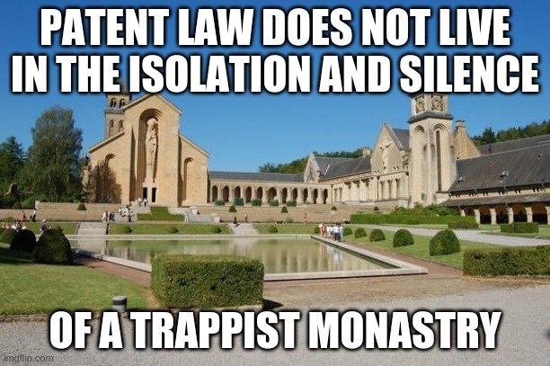

**FFII opposes the third attempt to impose software patents in Europe via the Unitary Patent Court (UPC). After UK's departure, FFII oppose any "quick fix" of the project, like simply replacing UK by Italy. The UPC cannot be "fixed", as its design is a international parallel court system outside the structures of the European Union, the European Court of Justice (CJEU) and the European Parliament.**

You can find below a copy of FFII's answer to the European Commission's public consultation on the “IP action plan”.

#### Introduction

Dear Members of the European Commission,

FFII welcome the opportunity to comment on this public consultation about the “IP action plan”. We will only comment on one point, the Unitary Patent and its Court (UPC), which we have followed for the last 15 years.

#### About FFII

The Foundation for a Free Information Infrastructure (FFII) is a pan-European alliance defending the rights to free and competitive software creation since 1999. We are working towards the mitigation of legal risks in software development. We do so by keeping software free from patents and promoting a digital infrastructure based on genuine open standards. More than 1,000 members, 3,000 companies and 100,000 supporters have entrusted the FFII to act as their voice in public policy questions concerning exclusion rights (intellectual property) in digital creativity. The FFII contributions enabled the **rejection of the EU software patent directive in July 2005**, working closely with the European Parliament and many partners from industry and civil society. CNET awarded the FFII the _Outstanding contribution to software development_ prize for this work.

#### The Unitary Patent and its Court

**FFII strongly oppose the UPC in its current form**, which is the third attempt to impose software patents in Europe via the jurisprudence of such a court. Our software companies oppose software patents, as they are a threat to their mere existence.

Most software developers consider software patents as an unjustified intervention of the state between their chair and their keyboard. Legal scholars have raised the incompatibility with freedom of expression, as software is considered as a literal work. Most economists do not support the extension of patents to the software sector, where the whole system has too many negative effects.

The UPC is a gross attempt to impose unpopular software patents against the will of software developers and software companies, via the jurisprudence of such a court. This backdoor has been confirmed by the European Commission itself on the 2012 UPC Memo, mentioning that patents for software could be validated by the UPC by using EPO’s loopholes like the infamous “technical effect” or the “as such” provision.

In 2006, we summarized the situation in a nutshell:

> _“In July 2005, after several failed attempts to legalize software patents in Europe, the patent establishment changed its strategy. **Instead of explicitly seeking to sanction the patentability of software, they are now seeking to create a central patent court** \[\[the UPC\]\], which would establish and enforce patentability rules in their favor, without any possibility of correction by competing courts or democratically elected legislators.”_

Back in 2007, we documented the problems of the predecessor of the UPC, the European Patent Litigation Agreement (EPLA). The UPC is nothing more than an EPLA “réchauffé”. Most of the problems listed are roughly the same as the ones we listed in 2007 (see [http://epla.ffii.org/analysis](http://epla.ffii.org/analysis)):

1. **Software patents granted by the EPO will be made enforceable**, using loopholes like the “technical effect” or “as such”;
2. **Litigation will be more expensive**, especially for small companies, raising the cost for a simple case compared to the current situation, awarding EU-wide damages, and stopping products from the market even if the patent is later found invalid (bifurcation);
3. **A captive Unitary Patent Court**: we have independent national courts and Supreme Courts for civil patent cases, we will have a captive Unitary Patent Court, with no Court of the Justice of the EU nor the European Parliament as correctives;
4. **A tribunal not established by law**: the Rules of procedure of the UPC were made by an administrative committee, which is not compliant with the principle of Art6 of the European Convention on Human Rights (ECHR) on a “tribunal established by law”;
5. **A patent office (the EPO) not following the Rule of Law**: an administration which has diplomatic immunity, and which cannot be sued for maladministration (or refusal to grant) in front of an independent court.

We invite the European Commission **not to pursue the Unitary Patent project any further**, as it has too many deficiencies, and look at simpler and cheaper alternatives, such as installing specialized tribunals within the premises of the European Court of Justice, like it was done for EU trademarks.

We would welcome a **dedicated public consultation on the options available**, including the keeping the status quo, and we will probably organize ourselves a virtual conference on this topic following the EUPACO series before the end of the year.  

The Unitary Patent in its current form is promoting patent maximalism, which is toxic and dangerous for society, and for all sectors of the economy. Patent maximalism can cost society a lot of money and a lot of jobs. It is not the moment to **worsen the COVID19 crisis by a patent crisis.**

The recent official departure of the UK from the project is creating the temptation to do a “quick fix” “à minima” by just replacing the UK by Italy (or any other country). This is what several companies and organizations are already promoting in this public consultation, only 2 weeks after the official deratification by the UK. We strongly oppose this “quick fix”, as the Unitary Patent project cannot be fixed, as its main design is to create a parallel captive justice system outside the structures of the European Union, including the European Court of Justice and the European Parliament. This design comes from the patent industry who wanted a patent on their own court, and from the UK’s allergy to the European Court of Justice, who managed to impose its veto over art6 and 8 of the project (appeal on points of law).  

European democracy should not be jeopardized by supporting and creating non-EU institutions (the EPO and the UPC). Outsourcing EU patent policy to non-EU institutions such as the EPO and the UPC is unacceptable for any supporter of the European project, and any believer in European democracy.  

The European Union should consider joining the EPC, as it was discussed in 2004, and put the EPO under parliamentary control. In 2011, the IPO (Intellectual Property Owners Association) suggested that the EU joining the EPC would take too much time, and doing without it would be faster.

We believe a revision of the EPC on the problem of the EPO and the rule of law will be forced by the German Constitutional Court soon, so a revision of the EPC might be a good moment to also consider the addition of the European Union as a member of the EPC.  

### Software Patents validated via the jurisprudence of a central patent court

We are concerned about the extension of patent law to the software sector. Patents are not designed for software development in mind, and they are a threat to the existence of our companies.

We started our interest in the development of a pan-european patent court system in July 2005, when the large software multinationals called to drop the software patent directive and pushed for a paneuropean patent court instead. When the directive was rejected, the EICTA (now DigitalEurope, mostly regrouping large companies) said:

> _“All the European institutions and industry have worked hard and constructively on the issue of CII patents for some time. Europe’s high tech industry will support the efforts of the European institutions **to find broader improvements to the European patent system** that will particularly benefit the interests of smaller companies.”_  
> 
> \-- EICTA, Europe’s High Tech Industry Welcomes European Parliament Decision

Less than 6 months after the rejection of the directive, the European Commission restarted a public consultation in January 2006 on a pan-european court system. One can easily make the link between the 2 events.

The ex-EPO representative in Brussels, David Sant, has also recognized the Unitary Patent is the perfect vehicule for validating software patents in Europe:

> _“He explains that there is a pressing need in Europe to harmonise national patent rulings and to ensure legal certainty. **The acrimonious debate over the proposed directive on computer-implemented inventions might never have arisen if the patent litigation system in Europe had been unified**, thereby eliminating the possibility of disparate national rulings on the same patent matter.”_
> 
> \-- David Sant, former EPO lobbyist in Brussels, Intelligence in Science

Software patents are diverting money from R&D (Research&Development) to P&L (Patents&Litigation). So instead of paying software engineers to write useful code and make useful products, software companies are forced to divert this money to fund patent filings, patent attorneys, and patent lawsuits.

The Unitary Patent project did not learn the lessons from other jurisdictions, especially the US experience, where the Supreme Court had to correct the biased patent courts of the CAFC over 15 times over the last 20 years. The current score of the match between the 2 institutions is of 22-7, a blood bath indicating there is a serious problem of pro-patent bias with specialized patent courts. Among the topics where the Supreme Court had to correct the deviance of those captive patent courts, we find important topics such as non patentability of software (Alice, 2014), non patentability of business methods (Bilski, 2010).

### Litigation will be more expensive for a simple case

We believe the Unitary Patent and its Courts need to be dropped, and the departure of the UK is a good opportunity to do so. We warned already in 2007 in our EPLA analysis that there was a risk to increase the cost of litigation for a simple court case (validity or infringement). 90% of patent cases happen within one country only (mostly Germany and UK), and only 10% of cases involve one country or more. So for the objective of solving this supposedly “important problem” of cross-border litigation, we take the risk of raising the cost for a simple case. This is simply not acceptable. Now that the UK has left, this percentage of cross-border litigation will drop to 7%, weakening even more this dubious justification for a common patent court.

The current Unitary Patent Court is a self-financed court, which is problematic in itself. It makes the court dependent on the number of cases, and that itself is a no go. We already have a European Patent Office which finances itself from the number of patents it grants (where examiners have a notation system which incite them grant patents, not reject them), we don’t want another institution which is dependent on the number of cases it judges. A court is not a company. Courts have to be financed by public means to ensure integrity.

In the case of Germany, defending itself in front of the UPC will be 3x more expensive then the current situation. This is totally not acceptable. Furthermore, the court fees were not decided by an elected legislator (the Parliament(s)), but by an ad-hoc administrative committee, advised by “experts” from the patent industry, but where no SMEs were represented. Among those “experts”, we can found large companies such as Nokia or BASF, but not any representative of small companies. Court fees are also different for validity and infringement, 10K EUR for an infringement case, while it is 20K EUR for a validity case, this is another bias in favour of patents. For a simple case where your company has to defend itself and want to countersue for validity, we are already at 30K EUR of just court fees. The guarantee of “Access to Justice” should be scrutinized and made by elected politicians, and not designed by administrative committees. We believe this is also not legal in many countries, where the amount of fees have to made by “law”. A recent article on Lexology also mentions the higher costs of the UPC for SMEs:

> _“Small and medium-sized enterprises (SMEs) in particular see a negative impact through the UPC. The main reason is the **increased costs, especially the high legal costs.**”_
> 
> \-- Dr. Natalie Kirchhofer, patent attorney and partner at Cohausz & Florack, in Lexology article “New draft legislation in Germany to ratify the Unified Patent Court”

The proposed Unitary Patent Court will worsen the access to the patent system, especially for defendants, and SMEs in particular. The future patent court will also probably eliminate the main line of defense for software SMEs, will show a pro-patent bias, and validate software patents despite their exclusion in the EPC art52.2.

### A captive patent court, with no Supreme Court on top, nor an elected parliament as legislator

Having a captive patent court without the judicial oversight of the European Court of Justice (CJEU) is dangerous for society. Patent law will evolve in its own bubble, without any interaction with other rights. Specialized patent courts have shown a dangerous bias for patent maximalism, including on the question of software patents (cfr Alice decision in the US). The recent decisions of the American Supreme Court correcting 17 times those patent courts should have inspired Europeans. As Judge Rifkin said in 1951 about specialized patent courts:  

> _“**Patent law does not live in the isolation and silence of a Trappist monastry**. It is part of a broader set of laws.”_
> 
> \-- Simon Rifkin, “A Specialized Court for Patent Litigation? The Danger of a Specialized Judiciary,” American Bar Association Journal, 37 (1951), 425-426.

_Isolation and silence of a Trappist Monastry, Orval, Belgium_ [https://www.florenville.org/fr/a-voir-mf/dans-la-commune/orval](https://www.florenville.org/fr/a-voir-mf/dans-la-commune/orval)

FFII has recently learned the reason why the CJEU was removed from the 2012 deal:

> _“We heard the rumor that Mr David Cameron was asked by the large UK pharmaceutical firm GlaxoSmithKline (GSK) to remove the CJEU as having a say in patent law (articles 6 and 8). That was the condition to have a deal with the UK. **Now that the UK has left, you know why the CJEU was removed from having a say over patent law, and software patents in particular.**”_  
> 
> — FFII press release of 23rd March 2020 “EU Software Patent Court stopped by Constitutional Court, patent industry will try again

The Patent Court will also operate in international waters and based on international patent law, which is not part of the “acquis communautaire”. It will be therefore out of reach for the EU institutions, and notably the European Parliament, the only elected law maker. The Unitary Patent Court will take decisions without being counterbalanced by an elected legislator. By accepting this compromise, the European Parliament has effectively committed suicide as a legislator in patent law.

### Links

- [https://ffii.org/eu-patent-system-taken-away-from-european-court-of-justice/](https://ffii.org/eu-patent-system-taken-away-from-european-court-of-justice/)
- [http://epla.ffii.org/sixreasons-upls](http://epla.ffii.org/sixreasons-upls)
- [http://epla.ffii.org/analysis](http://epla.ffii.org/analysis)
- [https://ec.europa.eu/info/law/better-regulation/have-your-say/initiatives/12510-Intellectual-property-action-plan/F543514](https://ec.europa.eu/info/law/better-regulation/have-your-say/initiatives/12510-Intellectual-property-action-plan/F543514)
